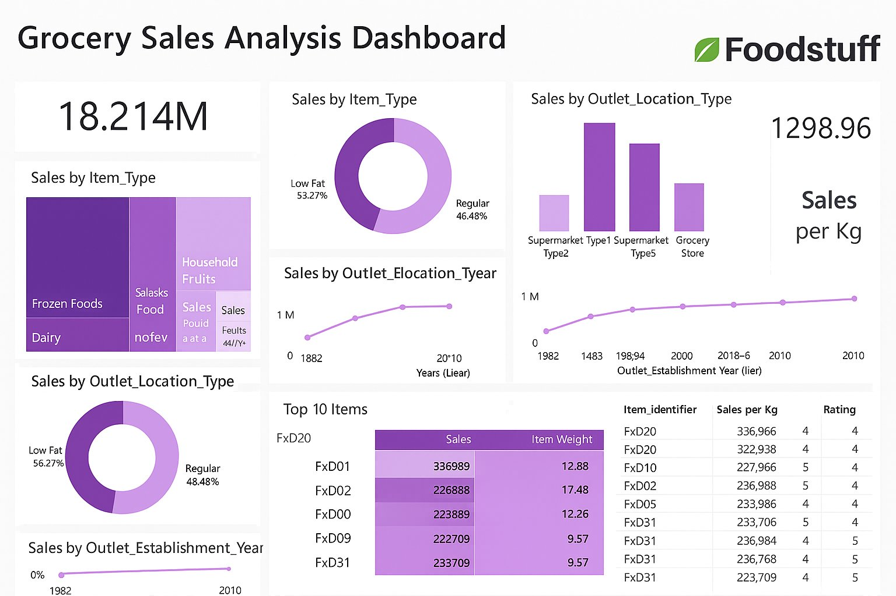

# Foodstuffs Grocery Sales Analysis
### Power BI Dashboard | Power Query | DAX | Data Visualisation



---

##  Project Objective

To analyse grocery sales data from multiple outlets to uncover patterns in product performance, outlet efficiency, and consumer preferences. The goal is to deliver actionable insights for inventory planning, pricing optimisation, and outlet-level strategy — ultimately improving profitability and customer satisfaction for Foodstuff.

---

##  Business Questions Answered

- Which product types and fat content categories generate the most sales?
- How does outlet type and location tier affect revenue?
- Does outlet age correlate with sales performance?
- What is the impact of item visibility on sales?
- Does a higher price (MRP) guarantee higher sales?

---

##  Key Metrics

| Metric | Value |
|---|---|
| Total Sales | $18.214M |
| Sales per Kg | 1,298.96 |
| Low Fat Sales Share | 53.27% |
| Top Performing Item | FxD01 ($336,989) |

---

## Key Findings

-  Low Fat products dominate sales (53.27%), especially in Tier 1 locations
-  Supermarket Type 1 outlets generate the highest revenue, but Type 3 has better sales per item
-  Outlet age positively correlates with sales — older outlets consistently perform better
-  Item visibility has a strong impact on sales; products with more than 10% visibility outperform others
-  High MRP does not guarantee high sales — price sensitivity varies by item type and outlet location

---

##  Strategic Value

This dashboard empowers Foodstuffs to:
- Optimise product placement and visibility across outlets
- Tailor pricing strategies by outlet type and region
- Identify underperforming items for promotion or removal
- Prioritise investment in high-performing outlet formats

---

##  Methodology

### 1. Data Extraction & Cleaning

**Tools:** Microsoft Excel, Power BI Power Query Editor

- Imported raw CSV from Kaggle into Power BI
- Removed nulls in Item Weight
- Standardised Item Fat Content (unified "Low Fat", "low fat", "LF" into one category)
- Trimmed and cleaned all text fields
- Changed data types (e.g. Outlet Establishment Date to whole number)
- Created new column: `Outlet Age = 2025 - [Outlet Establishment Year]`

---

### 2. Data Modeling

- Built a **star schema** for optimised performance
- Created relationships between:
  - Item attributes and outlet attributes
  - Fact table (sales) and dimension tables (item, outlet)

---

### 3. DAX Measures & Calculated Columns

**Key Measures:**

```
Total Sales = SUM(Sales[Sales])

Sales per Kg = DIVIDE(SUM(Sales[Sales]), SUM(Sales[Item Weight]))

Average MRP = AVERAGE(Sales[Item MRP])

Sales Growth % = ([Current Year Sales] - [Previous Year Sales]) / [Previous Year Sales]
```

**Calculated Columns:**

```
Outlet Age = 2025 - Sales[Outlet Establishment Year]

Sales per Visibility = DIVIDE(Sales[Sales], Sales[Item Visibility])
```

---

### 4. Visualisation

| Visual | What It Shows |
|---|---|
| KPI Cards | Total Sales, Sales per Kg |
| Tree Map | Sales by Item Type |
| Donut Chart | Sales by Fat Content |
| Bar Chart | Sales by Outlet Type |
| Line Chart | Sales by Outlet Establishment Year |
| Bubble Chart | Sales vs Visibility |
| Table | Top 10 Items with Weight and Rating |

---

##  Tools & Technologies

| Tool | Purpose |
|---|---|
| Power BI Desktop | Dashboard design and visualisation |
| Power Query | Data cleaning and transformation |
| DAX | Calculated measures and columns |
| Microsoft Excel | Initial data inspection and formatting |
| Kaggle | Data source |


